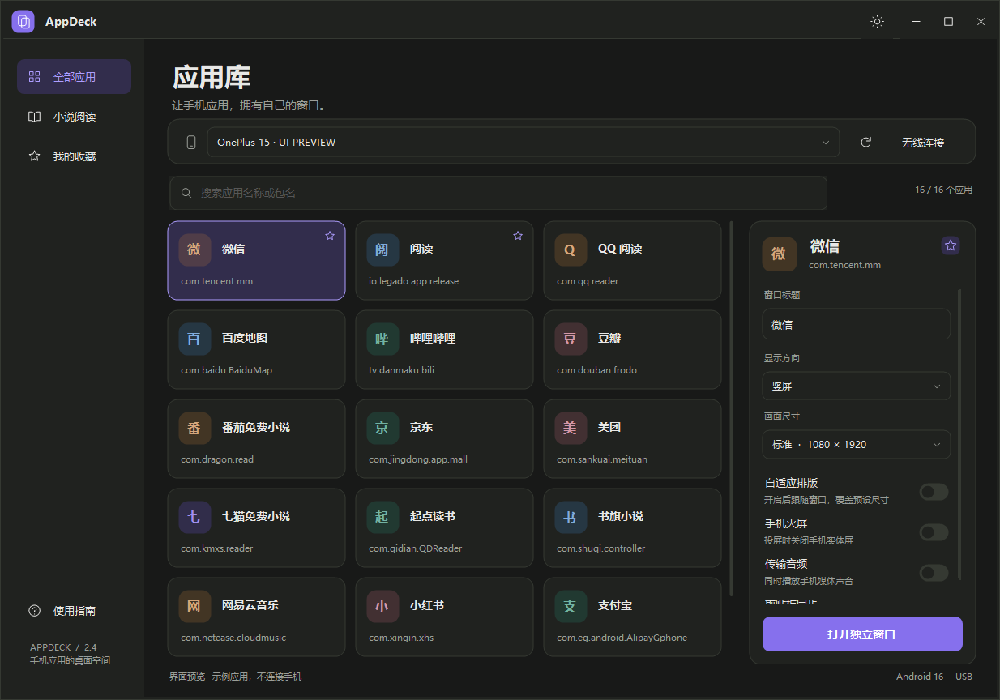
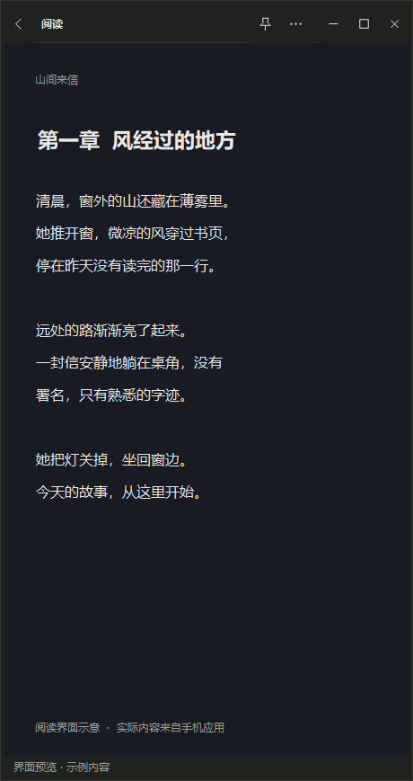

# AppDeck

让 Android 手机应用拥有独立的 Windows 桌面窗口。

AppDeck 通过 ADB 与 scrcpy 创建手机副屏，把指定应用的现有任务迁移到独立窗口中。手机可以继续操作其他应用；正常关闭投屏窗口时，原任务会保留页面并回到手机后台。无需 root，也不需要在手机上安装辅助 APK。



## 功能

- 读取已连接手机的用户应用，自动隐藏系统应用。
- 支持名称与包名搜索、小说阅读分类和本地收藏。
- 优先复用应用已有任务，保留当前页面；没有运行任务时才恢复最近任务或首次启动。
- 独立选择竖屏、横屏和四档分辨率，不改变手机主屏方向。
- 亮色／暗色主题、自绘窗口边框、置顶和托盘隐藏。
- 关闭主界面时可选择退出或最小化到托盘，并可记住选择。
- 每个应用的自定义窗口标题按包名保存。
- 可选手机实体屏灭屏、音频转发和剪贴板同步。
- Alt+W 快速隐藏／恢复投屏窗口，可单独关闭快捷键监听。
- 可将鼠标滚轮转换为音量键，并通过防抖适配小说软件的音量键翻页。



## 运行要求

- Windows 10/11 x64
- Android 手机已开启开发者选项和 USB 调试
- USB ADB 或 Android 无线调试连接
- .NET Framework 4.8

目前主要在一加 15、ColorOS 16、Android 16 上验证。不同厂商对虚拟显示器、多窗口和后台任务的实现存在差异，其他设备可能需要适配。

## 下载安装

在 [Releases](https://github.com/jaydenswork/AppDeck/releases) 下载最新的 `AppDeck-Setup-版本号.exe`，运行后可在安装向导中选择安装目录，并可选创建桌面快捷方式。安装版会创建开始菜单入口和卸载程序。

安装版的设置、日志和窗口标题保存在 `%LOCALAPPDATA%\AppDeck`。安装程序不读取或迁移便携版目录中的旧 `data`，新用户会直接创建全新配置。

当前公开构建没有受信任的代码签名证书，Windows SmartScreen 会把安装包显示为“发布者未知”，新版本也可能因为尚未积累文件信誉而出现保护提示。这是发布者身份与信誉提示，不表示 Microsoft 已检测到病毒。可使用同一 Release 中的 `.sha256` 文件核对下载完整性，但校验值不能替代代码签名。

## 从源码运行

仓库包含 AppDeck 源码、构建脚本，以及运行所需的 scrcpy 4.1、ADB、SDL 和 FFmpeg 文件。

```powershell
git clone https://github.com/jaydenswork/AppDeck.git
cd AppDeck
powershell -ExecutionPolicy Bypass -File .\build.ps1
.\AppDeck.exe
```

`build.ps1` 使用 Windows 自带的 .NET Framework x64 C# 编译器生成 `AppDeck.exe`，随后执行离线自检。源码目录直接运行时，配置仍保存在项目内的 `data/`。生成的 EXE、PDB、本机 `data/` 和安装包不提交到仓库。

本机已安装 Inno Setup 6 时，也可以生成安装包：

```powershell
.\installer\build-installer.ps1
```

安装包和 SHA-256 校验文件会写入 `dist/`。

## 自动发布 Release

仓库中的 GitHub Actions 工作流会在 `main` 更新时校验版本、编译 AppDeck、生成安装包、静默安装、自检、卸载，然后上传构建产物。创建与 `VERSION` 一致的标签即可自动发布 Release：

```powershell
git tag v2.5.0
git push origin v2.5.0
```

也可以在 GitHub Actions 页面手动运行工作流，只生成可下载的工作流构建产物，不创建 Release。

## 使用方法

1. 在手机开发者选项中开启 USB 调试，并允许当前电脑调试。
2. 运行 `AppDeck.exe`，等待顶部设备栏显示手机。
3. 搜索并选择应用，在右侧设置窗口标题、方向和尺寸。
4. 点击“打开独立窗口”，或双击应用卡片。
5. 正常关闭独立窗口后，同一 Android 任务会回到手机后台并保留当前页面。

无线连接时，手机和电脑需要位于同一网络。先在 Android 无线调试页面完成配对，再填写连接地址；配对端口与连接端口通常不同。

## 任务复用

AppDeck 不通过 `MULTIPLE_TASK` 重复创建应用副本。一次正常会话大致经过以下过程：

```text
查找现有任务 → 创建虚拟显示器 → 迁移原任务 → 嵌入 Windows 窗口
                                              ↓
手机后台 ← 恢复原窗口配置 ← 归还同一任务 ← 关闭窗口
```

如果应用没有运行任务，AppDeck 会先尝试恢复 Android 最近任务；最近任务也不存在时才执行首次启动。应用处于分屏、画中画或另一个副屏时，会要求先退出对应状态，避免创建重复任务。

任务归还失败且连接仍存在时，窗口不会直接销毁，可以恢复连接后重试。突然拔线或系统强制回收进程时，Android 可能自行把任务移回手机前台，这一行为无法完全控制。

## 显示方向与尺寸

| 预设 | 竖屏 | 横屏 |
| --- | --- | --- |
| 标准 | 1080 × 1920 | 1920 × 1080 |
| 长页 | 1080 × 2160 | 2160 × 1080 |
| 轻量 | 900 × 1600 | 1600 × 900 |
| 平板 | 1440 × 1920 | 1920 × 1440 |

“自适应排版”会让副屏分辨率跟随电脑窗口尺寸，并覆盖固定预设。应用仍可能根据自身的多窗口策略限制横屏、产生留边或重建 Activity。

## 投屏窗口

标题栏左侧是返回键，右侧提供置顶和更多菜单。更多菜单包括：

- 手机锁屏：关闭手机实体屏，副屏继续运行。该操作是灭屏，不等同于 Android 安全锁定。
- 修改窗口标题：标题按应用包名保存在 `data/window-titles.xml`。
- 快捷键：配置 Alt+W、隐藏行为和滚轮音量映射。
- 重新连接：先归还当前任务，再重新创建副屏会话。
- 切换主题：所有 AppDeck 窗口同步切换亮暗主题。

滚轮音量映射开启后，向上滚动发送音量加，向下滚动发送音量减。小说应用需要自行开启“音量键翻页”，否则它会正常调整媒体音量。

## 主窗口与托盘

首次关闭主窗口时，可以选择“退出程序”或“最小化到托盘”，并可勾选“记住我的选择”。最小化到托盘不会关闭已经打开的投屏窗口；双击托盘图标可以恢复主界面，托盘右键菜单可以直接退出 AppDeck。

## 本地数据与隐私

安装版把配置和诊断信息保存在 `%LOCALAPPDATA%\AppDeck`；源码目录直接运行时保存在程序目录的 `data/`。项目内的 `data/` 已被 Git 忽略：

| 文件 | 内容 |
| --- | --- |
| `data/settings.xml` | 主题、设备、显示参数和收藏 |
| `data/controls.ini` | 快捷键与滚轮设置 |
| `data/window-titles.xml` | 按包名保存的窗口标题 |
| `data/task-sessions/` | 尚待归还任务的恢复记录 |
| `data/logs/` | ADB/scrcpy 会话诊断日志 |

AppDeck 不主动记录手机画面或聊天正文。日志可能包含设备序列号、应用包名和本机路径，提交问题前请先检查并脱敏。

剪贴板同步和音频转发都是设备级能力，并不保证只涉及当前投屏应用。敏感场景可在打开窗口前关闭对应开关。

## 项目结构

```text
AppDeck/
├─ src/                 Windows 界面、设备目录和会话管理
├─ native/              scrcpy 输入补丁与 Android 任务辅助源码
├─ runtime/scrcpy/      scrcpy、ADB、依赖 DLL 和辅助 DEX/JAR
├─ assets/              应用图标
├─ docs/images/         README 界面预览
├─ build.ps1            .NET Framework x64 构建与自检
├─ THIRD_PARTY.md       第三方组件和来源
└─ VERIFICATION.md      已完成验证与已知边界
```

重建修改版 scrcpy 客户端或 Android 辅助 JAR 的环境与命令见 [native/README.md](native/README.md)。设备验证记录见 [VERIFICATION.md](VERIFICATION.md)。

## 已知限制

- 一个 Android 任务同一时间只能位于手机或投屏窗口中的一处，不能依靠本功能双开同一任务。
- 部分金融、视频或受保护应用会禁止录屏、音频捕获或多窗口显示。
- 微信小程序属于微信任务的一部分，需要先打开微信，再从微信内部进入小程序。
- 真正锁屏后仍需在手机上完成系统解锁；AppDeck 的“手机锁屏”当前只关闭实体屏。
- Android 厂商系统升级可能改变隐藏任务接口，需要重新验证兼容性。

## 第三方组件与许可

AppDeck 基于 [Genymobile/scrcpy 4.1](https://github.com/Genymobile/scrcpy/releases/tag/v4.1)，并随附 Android Platform Tools、SDL、FFmpeg 和 libusb 运行组件。修改内容、版本、校验值和许可证位置见 [THIRD_PARTY.md](THIRD_PARTY.md)。

AppDeck 自有源码采用 [Apache License 2.0](LICENSE)。仓库公开不改变第三方组件各自的许可，使用和再分发时也应遵守对应许可证。
